# Awesome Property Valuation & AVM Platform Ecosystem

[](https://github.com/ishandutta2007/Awesome-Property-Valuation-Platform)

## Top Property Valuation Platform (AVM), Mass Appraisal & Real Estate Analytics Ecosystem

[](https://github.com/ishandutta2007/Awesome-Property-Valuation-Platform)
[](https://opensource.org/licenses/MIT)
[](https://github.com/ishandutta2007/Awesome-Property-Valuation-Platform/blob/main/README.md#how-to-contribute)
[](#)

A curated catalog of commercial **SaaS platforms**, enterprise data providers, and open-source **GitHub repositories** for **Property Valuation**, **Automated Valuation Models (AVM)**, **Mass Appraisal**, and **Real Estate Machine Learning Analytics**.

These systems leverage hedonic regression, spatial algorithms, gradient boosting, and deep learning architectures to compute high-accuracy residential and commercial Automated Valuation Models at scale for mortgage lenders, institutional real estate investors, appraisers, proptech startups, and tax assessors.

---

## Table of Contents

- [Industry & Market Structure](#industry--market-structure)
- [SaaS & Commercial Platforms](#saas--commercial-platforms)
- [Open-Source GitHub Projects](#open-source-github-projects)
- [Open-Source Architecture & Workflow](#open-source-architecture--workflow)
- [How to Contribute](#how-to-contribute)
- [Disclaimer](#disclaimer)

---

## Industry & Market Structure

The global **Real Estate Data Analytics & Automated Valuation Model (AVM)** market is estimated at **$15.8 Billion by 2032** (growing at a ~12.4% CAGR from 2024).

> **Market Concentration Status**: The market is **moderately fragmented**, featuring high-barrier enterprise data oligopolies (such as CoreLogic) coexisting with agile, AI-driven proptech scale-ups (HouseCanary, PriceHubble) and domain-specific valuation software vendors (ValueLink).

While national property tax records and MLS data feeds create high moats for commercial data providers, open-source mass appraisal toolkits (such as OpenAVMKit and Cook County's open models) are standardizing machine learning algorithms across public assessor offices and research institutions.

---

## SaaS & Commercial Platforms

The table below lists leading commercial Automated Valuation Model (AVM) platforms, ranked descending by **Scale / Annual Revenue / Valuation**.

| Product | Company Scale (Revenue / Valuation) | Description | Pricing | Free Tier / Trial Limits |
| :--- | :--- | :--- | :--- | :--- |
| **[CoreLogic Total Home Value](https://www.corelogic.com/)** | **~$1.4B Revenue** (Acquired for $6.0B) | Industry-standard property data, risk analytics, and AVM solutions widely deployed across top mortgage lenders and financial institutions. | $25 per transaction/report (Enterprise contracts start at $12,000/year quote-based) | No free trial; interactive live product demo available upon request |
| **[Clear Capital](https://www.clearcapital.com/)** | **~$250M+ Revenue** (Privately held) | Real estate valuation technology spanning enterprise AVMs, BPOs, and automated appraisal management for collateral risk workflows. | $15 per AVM report (Volume/Enterprise contracts quote-based) | No free tier; sample report and API demo access available upon contact |
| **[Walker & Dunlop / GeoPhy](https://www.geophy.com/)** | **$85M Acquisition** (Walker & Dunlop CRE) | Commercial real estate (CRE) data analytics and Automated Valuation Model platform optimized for multifamily and income-producing properties. | $250/month (Commercial property analytics base user seat) | 7-day free trial available upon sales qualification |
| **[HouseCanary](https://www.housecanary.com/)** | **~$17.9M Revenue** ($130M+ Total Funding) | AI-powered residential property valuation, valuation accuracy scoring, and predictive market analytics covering US single-family properties. | $19/month (Basic plan, billed at $190/year) | 7-day limited free trial available upon user registration |
| **[PriceHubble](https://www.pricehubble.com/)** | **~$14.4M Revenue** (Series B Scale-up) | API-first international property valuation and real-estate market intelligence platform operating across Europe and Asia. | €156/month (Europe real estate pro agent starting tier) | 14-day free trial available for verified professional users |
| **[ValueLink](https://www.valuelinksoftware.com/)** | **~$10.0M Revenue** (Privately held) | Enterprise valuation management system (VMS) supporting appraisal management companies (AMCs), lenders, and appraiser workflows. | $19.99/month (Appraiser portal user fee) / $29.99 per active vendor/month | 14-day free trial on valuation management modules |
| **[Hometrack](https://www.hometrack.com/)** | **~$8.5M Revenue** (ZPG / Zoopla Group) | UK & Australia property data analytics and automated valuation engine powering bank mortgage underwriting and risk assessment. | £99/month (UK analytics portal base seat rate) | 14-day trial period provided upon sales enquiry |
| **[Realyse](https://www.realyse.com/)** | **~$5.0M Revenue** (Privately held) | UK residential property valuation, yield analytics, and development site feasibility platform for estate agents and lenders. | £150/month (UK real estate platform starting tier) | 7-day free trial granted upon qualified demo request |
| **[Quantarium](https://www.quantarium.com/)** | **~$2.4M Revenue** (Acquired by Xome) | AI-driven computer vision and Automated Valuation Model engine generating property valuations and confidence metrics. | $49/month (Quantarium Professional tier) | 14-day full platform free trial for new registrants |
| **[PropMix](https://www.propmix.io/)** | **~$1.8M Revenue** (Privately held) | Real estate data insights, appraisal workflow automation, and portfolio AVM monitoring API platform. | $29/month (Starter API & valuation insights tier) | 30-day free trial on Portfolio Monitoring & Insights tools |

---

## Open-Source GitHub Projects

Below is a curated list of top open-source repositories for **Automated Valuation Models (AVM)**, **Mass Appraisal**, **Spatial Regression**, and **Real Estate ML pipelines**, sorted in descending order by **GitHub Star Count**.

| Repository | GitHub Stars | Description | Core Stack / Methods |
| :--- | :--- | :--- | :--- |
| **[Cook County Assessor Residential AVM](https://github.com/ccao-data/model-res-avm)** | [](https://github.com/ccao-data/model-res-avm/stargazers) | Open-source residential automated valuation model system developed by Cook County Assessor's Office for mass property tax assessment. | R, LightGBM, Spatial Features |
| **[Cook County Assessor Condo AVM](https://github.com/ccao-data/model-condo-avm)** | [](https://github.com/ccao-data/model-condo-avm/stargazers) | Specialized open-source condominium Automated Valuation Model pipeline utilizing building characteristics and unit spatial modeling. | R, XGBoost, Condominium Hedonics |
| **[re-avm](https://github.com/rlowrance/re-avm)** | [](https://github.com/rlowrance/re-avm/stargazers) | Open real estate automated valuation model project demonstrating hedonic price indexing and spatial regression algorithms. | Python, Scikit-learn, GIS |
| **[ML-based-AVM](https://github.com/Linhkust/ML-based-AVM)** | [](https://github.com/Linhkust/ML-based-AVM/stargazers) | Machine learning pipeline for automated property valuation, featuring comparative benchmark modeling with Random Forest and Gradient Boosting. | Python, XGBoost, Random Forest |
| **[OpenAVMKit](https://github.com/larsiusprime/openavmkit)** | [](https://github.com/larsiusprime/openavmkit?style=social&color=white/stargazers) | Open-source Python toolkit for real-estate mass appraisal and AVM modeling with configurable data cleaning, feature engineering, and IAAO ratio testing. | Python, Pandas, GeoPandas |
| **[AutomaticValuationModel](https://github.com/jayshah5696/AutomaticValuationModel)** | [](https://github.com/jayshah5696/AutomaticValuationModel/stargazers) | Modular Cookiecutter-structured production prototype for real estate property price prediction models. | Python, Jupyter, Cookiecutter |

---

## Open-Source Architecture & Workflow

For proptech developers, assessors, and researchers building custom valuation pipelines on open-source toolkits:

```
[ Public Assessor & MLS Data ] ──> [ Data Cleaning & Geo-Enrichment ] ──> [ Hedonic / ML Modeling ]
                                             (OpenAVMKit / Pandas)              (LightGBM / XGBoost)
                                                                                          │
                                                                                          ▼
[ IAAO Ratio Diagnostics & Metrics ] <── [ Confidence Score Generator ] <── [ Property Valuation Predictions ]
```

1. **Data Acquisition**: Ingest public assessor tax rolls, parcel geometry, and historical deed transactions.
2. **Feature Engineering**: Compute spatial proximity features (distance to schools, transit hubs, coastlines) using GeoPandas.
3. **Model Training**: Fit spatial hedonic models or ensemble tree algorithms (LightGBM / CatBoost).
4. **Statistical Diagnostics**: Evaluate performance using standard International Association of Assessing Officers (IAAO) ratio studies (Median Ratio, COD, PRD).

---

## How to Contribute

Contributions are highly encouraged! To add or update an entry:

1. Fork this repository.
2. Update `README.md` following the tabular format and star badge links.
3. Ensure entries include factual descriptions, verified starting prices, and correct GitHub star links.
4. Open a Pull Request with a short summary of changes.

---

## Disclaimer

- This repository is a **community-curated index** for research and educational purposes.
- Automated Valuation Models (AVMs) provide statistical estimates and do not replace formal appraisals certified by licensed appraisers. Use of AVMs in underwriting or government tax assessment is subject to statutory and legal guidelines.

---

**Built for lenders, appraisers, quantitative real estate investors, and proptech software engineers.**
